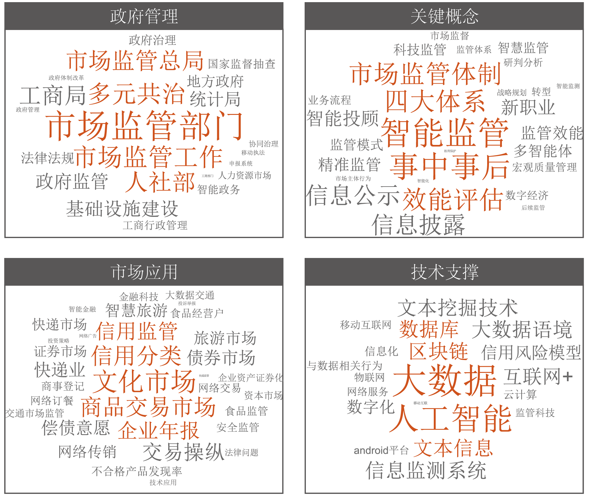

# 用人工智能实现智能市场监管的现状和趋势探索
袁培江1，王越2，苏峰1      
1 北京航空航天大学； 2 国金证券      
       
**关键词：市场监管；人工智能；智能监管；监管体系；社会共治**

## 说明
- ***Data references CNKI*** 中国知网搜索的参考文献原始数据
- ***Data network Gephi*** 词频共现网络数据，包括节点和边数据（.csv）和网络数据（.gephi）
- ***Data wordcloud*** 分类词云，政府管理、监管理论、市场应用、技术支撑

## 用词频共现网络分析领域热点
 
 
